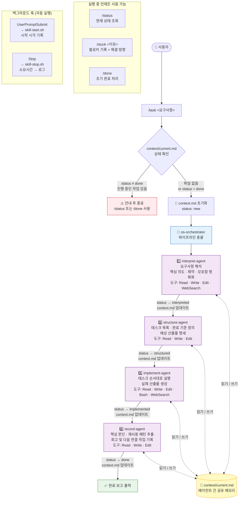
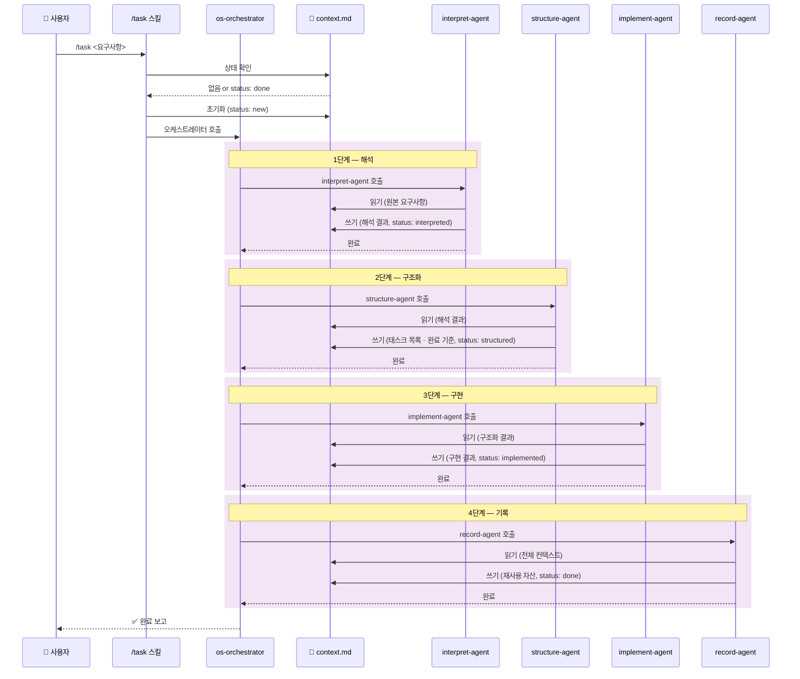
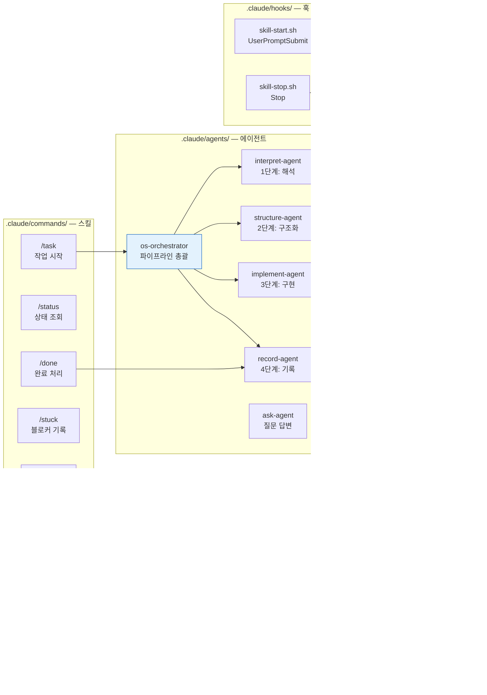

# nextstep-claude-os 워크플로우

## `/task` 전체 흐름

```mermaid
flowchart TD
    User([👤 사용자]) --> Task["/task &lt;요구사항&gt;"]

    Task --> Check{"context/current.md\n상태 확인"}
    Check -- "status ≠ done\n진행 중인 작업 있음" --> Warn["⚠️ 안내 후 종료\n/status 또는 /done 사용"]
    Check -- "파일 없음\nor status = done" --> Init["📄 context.md 초기화\nstatus: new"]

    Init --> Orch["🎯 os-orchestrator\n파이프라인 총괄"]

    Orch --> S1["1️⃣ interpret-agent\n요구사항 해석\n핵심 의도 · 제약 · 모호함 명확화\n도구: Read · Write · Edit · WebSearch"]
    S1 -- "status → interpreted\ncontext.md 업데이트" --> S2

    S2["2️⃣ structure-agent\n태스크 목록 · 완료 기준 정의\n예상 산출물 명세\n도구: Read · Write · Edit"]
    S2 -- "status → structured\ncontext.md 업데이트" --> S3

    S3["3️⃣ implement-agent\n태스크 순서대로 실행\n실제 산출물 생성\n도구: Read · Write · Edit · Bash · WebSearch"]
    S3 -- "status → implemented\ncontext.md 업데이트" --> S4

    S4["4️⃣ record-agent\n핵심 판단 · 재사용 패턴 추출\n회고 및 다음 연결 작업 기록\n도구: Read · Write · Edit"]
    S4 -- "status → done\ncontext.md 업데이트" --> Done["✅ 완료 보고 출력"]

    Context[("📄 context/current.md\n에이전트 간 공유 메모리")]

    S1 <-.->|"읽기 / 쓰기"| Context
    S2 <-.->|"읽기 / 쓰기"| Context
    S3 <-.->|"읽기 / 쓰기"| Context
    S4 <-.->|"읽기 / 쓰기"| Context

    subgraph side["실행 중 언제든 사용 가능"]
        Status["/status\n현재 상태 조회"]
        Stuck["/stuck &lt;이유&gt;\n블로커 기록 + 해결 방향"]
        DoneCmd["/done\n조기 완료 처리"]
    end

    subgraph hooks["백그라운드 훅 (자동 실행)"]
        Hook1["UserPromptSubmit\n→ skill-start.sh\n시작 시각 기록"]
        Hook2["Stop\n→ skill-stop.sh\n소요시간 → 로그"]
    end

    style Context fill:#fff9c4,stroke:#f9a825
    style Orch fill:#e3f2fd,stroke:#1565c0
    style S1 fill:#f3e5f5,stroke:#6a1b9a
    style S2 fill:#f3e5f5,stroke:#6a1b9a
    style S3 fill:#f3e5f5,stroke:#6a1b9a
    style S4 fill:#f3e5f5,stroke:#6a1b9a
    style Done fill:#e8f5e9,stroke:#2e7d32
    style Warn fill:#ffebee,stroke:#c62828
```

---

## 에이전트 간 상호작용 (Sequence)

```mermaid
sequenceDiagram
    participant U as 👤 사용자
    participant T as /task 스킬
    participant O as os-orchestrator
    participant C as 📄 context.md
    participant I as interpret-agent
    participant S as structure-agent
    participant Im as implement-agent
    participant R as record-agent

    U->>T: /task <요구사항>
    T->>C: 상태 확인
    C-->>T: 없음 or status: done
    T->>C: 초기화 (status: new)
    T->>O: 오케스트레이터 호출

    rect rgb(243, 229, 245)
        Note over O,I: 1단계 — 해석
        O->>I: interpret-agent 호출
        I->>C: 읽기 (원본 요구사항)
        I->>C: 쓰기 (해석 결과, status: interpreted)
        I-->>O: 완료
    end

    rect rgb(243, 229, 245)
        Note over O,S: 2단계 — 구조화
        O->>S: structure-agent 호출
        S->>C: 읽기 (해석 결과)
        S->>C: 쓰기 (태스크 목록 · 완료 기준, status: structured)
        S-->>O: 완료
    end

    rect rgb(243, 229, 245)
        Note over O,Im: 3단계 — 구현
        O->>Im: implement-agent 호출
        Im->>C: 읽기 (구조화 결과)
        Im->>C: 쓰기 (구현 결과, status: implemented)
        Im-->>O: 완료
    end

    rect rgb(243, 229, 245)
        Note over O,R: 4단계 — 기록
        O->>R: record-agent 호출
        R->>C: 읽기 (전체 컨텍스트)
        R->>C: 쓰기 (재사용 자산, status: done)
        R-->>O: 완료
    end

    O-->>U: ✅ 완료 보고
```

---

## 컴포넌트 구조

```mermaid
graph LR
    subgraph commands[".claude/commands/ — 스킬"]
        task["/task\n작업 시작"]
        status["/status\n상태 조회"]
        done["/done\n완료 처리"]
        stuck["/stuck\n블로커 기록"]
        ask["/ask\n개발 질문"]
        skillstat["/skill-stat\n통계 출력"]
        slackstat["/slack-stat\n통계 → Slack"]
        gitcommit["/git-commit\n자동 커밋"]
    end

    subgraph agents[".claude/agents/ — 에이전트"]
        orch["os-orchestrator\n파이프라인 총괄"]
        interp["interpret-agent\n1단계: 해석"]
        struct["structure-agent\n2단계: 구조화"]
        impl["implement-agent\n3단계: 구현"]
        rec["record-agent\n4단계: 기록"]
        askagent["ask-agent\n질문 답변"]
    end

    subgraph hooks[".claude/hooks/ — 훅"]
        start["skill-start.sh\nUserPromptSubmit"]
        stop["skill-stop.sh\nStop"]
    end

    subgraph storage["저장소"]
        ctx["context/current.md\n작업 상태"]
        log["~/.claude/skill-usage.log\n사용 통계"]
    end

    task --> orch
    done --> rec
    orch --> interp & struct & impl & rec
    interp & struct & impl & rec <--> ctx
    start & stop --> log

    style orch fill:#e3f2fd,stroke:#1565c0
    style ctx fill:#fff9c4,stroke:#f9a825
    style log fill:#fff9c4,stroke:#f9a825
```
